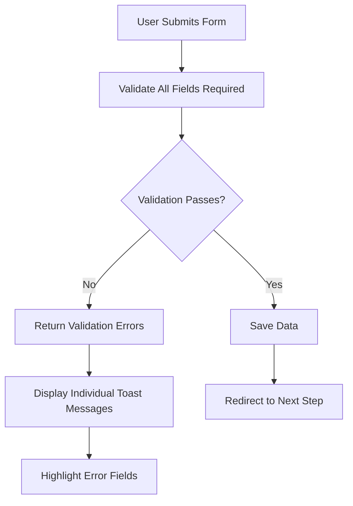

# Personal Details Form Implementation

## Overview

This document outlines the implementation of enhanced validation and user experience features for the personal details form (financial assistance page) to match the functionality implemented in the education details page. The enhancements include making all fields required, adding placeholders, implementing individual toast messages for validation errors, adding field highlighting for errors, and removing error highlighting when users start typing.

## Architecture

The implementation follows the existing Laravel MVC pattern with the following components:

1. **Frontend (Blade Template)**: `resources/views/financial-assistance.blade.php`
2. **Backend Controller**: `app/Http/Controllers/FinancialAssistanceController.php`
3. **Model**: `app/Models/FinancialAssistance.php`
4. **Validation**: Laravel's built-in validation system

The implementation will modify the existing form to match the enhanced user experience patterns established in the education details form.

## Frontend Implementation

### 1. Field Placeholders

All form fields will be updated to include descriptive placeholders to guide users on the expected input format. Examples include:

```html
<!-- Personal Information Fields -->
<input placeholder="e.g. John" ... />
<input placeholder="e.g. Doe" ... />
<input placeholder="e.g. 123456789012" ... />

<!-- Address Fields -->
<input placeholder="e.g. 123" ... />
<input placeholder="e.g. Apartment Name" ... />
<input placeholder="e.g. Mumbai" ... />

<!-- Contact Fields -->
<input placeholder="e.g. john@example.com" ... />
<input placeholder="e.g. 9876543210" ... />
```

### 2. Error Highlighting

CSS classes will be added to highlight fields with validation errors:

```css
.border-error {
    border-color: #ef4444;
    border-width: 2px;
}
.field-error {
    border: 2px solid #ef4444 !important;
}
```

### 3. JavaScript Enhancements

The frontend JavaScript will be enhanced to:

-   Remove error highlighting when users start typing in a field
-   Display individual toast messages for each validation error
-   Calculate field labels for better error messaging
-   Handle form submission with AJAX for better user experience

Key JavaScript enhancements include:

```javascript
// Add event listeners to remove error highlighting when user starts typing
const inputs = form.querySelectorAll("input, select, textarea");
inputs.forEach((input) => {
    input.addEventListener("input", function () {
        if (this.classList.contains("field-error")) {
            this.classList.remove("field-error");
            this.classList.add("border-gray-300");
        }
    });
});

// Function to get field label for better error messages
function getFieldLabel(fieldName) {
    const labelMap = {
        name: "Name",
        applicant: "Applicant",
        request_date: "Request Date",
        financial_asst_type: "Financial Assistance Type",
        financial_asst_for: "Financial Assistance For",
        aadhar_number: "Aadhar Number",
        date_of_birth: "Date of Birth",
        birth_place: "Birth Place",
        student_first_name: "Student First Name",
        last_name: "Last Name",
        marital_status: "Marital Status",
        native_place: "Native Place",
        age: "Age",
        gender: "Gender",
        student_mobile: "Student Mobile",
        religion: "Religion",
        student_email: "Student Email",
        pan_no: "PAN Number",
        flat_no: "Flat Number",
        name_of_building: "Name of Building",
        area: "Area",
        pincode: "Pincode",
        status: "Status",
        city: "City",
        district: "District",
        postal_address: "Postal Address",
        chapter: "Chapter",
        // Additional field mappings
    };

    return labelMap[fieldName] || fieldName;
}

// Function to display individual toast messages
function showMessage(message, type) {
    const messageDiv = document.createElement("div");
    const bgColor =
        type === "success"
            ? "bg-green-100 border-green-400 text-green-700"
            : type === "info"
            ? "bg-blue-100 border-blue-400 text-blue-700"
            : "bg-red-100 border-red-400 text-red-700";

    messageDiv.className = `px-4 py-3 rounded mb-4 border ${bgColor}`;
    messageDiv.innerHTML = `
        <div class="flex">
            <div class="flex-1">
                <p class="text-sm">${message}</p>
            </div>
            <button onclick="this.parentElement.parentElement.remove()" class="ml-4 text-lg font-bold">&times;</button>
        </div>
    `;

    messageContainer.appendChild(messageDiv);

    setTimeout(() => {
        if (messageDiv.parentNode) {
            messageDiv.remove();
        }
    }, 10000);
}
```

### 4. Form Submission Handling

The form submission will be enhanced to use AJAX for better user experience:

````javascript
form.addEventListener('submit', function(e) {
    e.preventDefault();

    // Clear previous error highlights
    clearErrorHighlights();

    // Disable submit button during processing
    submitBtn.disabled = true;
    submitText.classList.add('hidden');
    loadingText.classList.remove('hidden');

    // Submit form via AJAX
    const formData = new FormData(form);

    fetch(form.action, {
        method: 'POST',
        body: formData,
        headers: {
            'X-CSRF-TOKEN': document.querySelector('meta[name="csrf-token"]').getAttribute('content'),
            'X-Requested-With': 'XMLHttpRequest'
        }
    })
    .then(response => {
        // Handle redirects
        if (response.redirected) {
            window.location.href = response.url;
            return Promise.reject('redirected');
        }

        // Check if the response is JSON
        const contentType = response.headers.get('content-type');

        if (contentType && contentType.includes('application/json')) {
            return response.json().then(data => {
                return { ok: response.ok, data: data, status: response.status };
            });
        } else {
            // If not JSON, it's likely an HTML redirect or error page
            if (response.ok) {
                window.location.reload();
                return Promise.reject('reload');
            } else {
                return response.text().then(text => {
                    throw new Error(`HTTP error! status: ${response.status}, body: ${text}`);
                });
            }
        }
    })
    .then(result => {
        // Skip processing if we've already handled redirect or reload
        if (!result) return;

        const { ok, data, status } = result;

        if (ok) {
            // Success case
            if (data.success) {
                showMessage('Personal details saved successfully!', 'success');
                // Redirect to family details page
                setTimeout(() => {
                    window.location.href = '{{ route("family-details", ["submission_id" => $submissionId ?? ""]) }}';
                }, 1500);
            } else {
                showMessage(data.message || 'Operation completed successfully!', 'success');
            }
        } else {
            // Error case (including validation errors)
            if (data.errors) {
                // Display individual field errors as separate toast messages
                let firstErrorField = null;
                for (const field in data.errors) {
                    data.errors[field].forEach(error => {
                        showMessage(`${getFieldLabel(field)}: ${error}`, 'error');
                    });

                    // Highlight the field with error
                    const fieldElement = document.getElementById(field);
                    if (fieldElement) {
                        fieldElement.classList.remove('border-gray-300');
                        fieldElement.classList.add('field-error');

                        // Keep track of the first error field for scrolling
                        if (!firstErrorField) {
                            firstErrorField = fieldElement;
                        }
                    } else {
                        // For fields without IDs, we need to find them by name attribute
                        const fieldElements = document.querySelectorAll(`[name="${field}"]`);
                        if (fieldElements.length > 0) {
                            fieldElements.forEach(element => {
                                element.classList.remove('border-gray-300');
                                element.classList.add('field-error');
                            });

                            // Keep track of the first error field for scrolling
                            if (!firstErrorField) {
                                firstErrorField = fieldElements[0];
                            }
                        }
                    }
                }

                // Scroll to the first error field
                if (firstErrorField) {
                    firstErrorField.scrollIntoView({ behavior: 'smooth', block: 'center' });
                    firstErrorField.focus();
                }
            } else {
                // Handle other types of errors
                showMessage(data.message || `Error: ${status}`, 'error');
            }
        }
    })
    .catch(error => {
        // Handle network errors or other exceptions
        console.error('Error:', error);
        if (error !== 'redirected' && error !== 'reload') {
            showMessage('An error occurred. Please try again.', 'error');
        }
    })
    .finally(() => {
        submitBtn.disabled = false;
        submitText.classList.remove('hidden');
        loadingText.classList.add('hidden');
    });
});

## Backend Implementation

### 1. Controller Updates

The `FinancialAssistanceController@store` method will be updated to:

-   Make all fields required in the validation rules
-   Return structured JSON responses for AJAX requests
-   Handle validation errors with detailed field-specific messages
-   Add custom validation error messages for better user experience

### 2. Validation Rules

The validation rules will be updated to require all fields with specific validation rules:

```php
$validator = Validator::make($request->all(), [
    // Basic Information
    'applicant' => 'required|string|max:255',
    'name' => 'required|string|max:255',
    'request_date' => 'required|date',
    'financial_asst_type' => 'required|string',
    'financial_asst_for' => 'required|string|max:255',

    // Personal Details
    'aadhar_number' => 'required|string|size:12|regex:/^[0-9]{12}$/',
    'date_of_birth' => 'required|date|before:today',
    'birth_place' => 'required|string|max:255',
    'student_first_name' => 'required|string|max:255',
    'middle_name' => 'nullable|string|max:255',
    'last_name' => 'required|string|max:255',
    'marital_status' => 'required|in:single,married,divorced,widowed',
    'native_place' => 'required|string|max:255',
    'age' => 'required|integer|min:1|max:120',
    'nationality' => 'required|string|max:100',
    'gender' => 'required|in:male,female,other',
    'religion' => 'required|string|max:100',
    'specially_abled' => 'nullable|in:yes,no',
    'blood_group' => 'nullable|in:A+,A-,B+,B-,AB+,AB-,O+,O-',
    'student_email' => 'required|email|max:255',
    'student_mobile' => 'required|string|regex:/^[0-9]{10}$/',
    'pan_no' => 'nullable|string|regex:/^[A-Z]{5}[0-9]{4}[A-Z]{1}$/',

    // Permanent Address
    'flat_no' => 'required|string|max:50',
    'floor' => 'required|string|max:50',
    'name_of_building' => 'required|string|max:255',
    'area' => 'required|string|max:255',
    'lane' => 'required|string|max:255',
    'landmark' => 'required|string|max:255',
    'pincode' => 'required|string|regex:/^[0-9]{6}$/',
    'status' => 'required|string|max:100',
    'city' => 'required|string|max:100',
    'postal_address' => 'required|string',
    'new_zone' => 'nullable|string|max:100',
    'district' => 'required|string|max:100',
    'chapter' => 'required|string',

    // Correspondence Address
    'same_as_permanent' => 'nullable|boolean',
    'corr_flat_no' => 'nullable|required_if:same_as_permanent,0|string|max:50',
    'corr_floor' => 'nullable|required_if:same_as_permanent,0|string|max:50',
    'corr_name_of_building' => 'nullable|required_if:same_as_permanent,0|string|max:255',
    'corr_area' => 'nullable|required_if:same_as_permanent,0|string|max:255',
    'corr_lane' => 'nullable|required_if:same_as_permanent,0|string|max:255',
    'corr_landmark' => 'nullable|required_if:same_as_permanent,0|string|max:255',
    'corr_pincode' => 'nullable|required_if:same_as_permanent,0|string|regex:/^[0-9]{6}$/',
    'corr_status' => 'nullable|required_if:same_as_permanent,0|string|max:100',
    'corr_city' => 'nullable|required_if:same_as_permanent,0|string|max:100',
    'corr_postal_address' => 'nullable|required_if:same_as_permanent,0|string',
    'corr_new_zone' => 'nullable|string|max:100',
    'corr_district' => 'nullable|required_if:same_as_permanent,0|string|max:100',
    'corr_chapter' => 'nullable|required_if:same_as_permanent,0|string',
    'alternate_mail_id' => 'nullable|email|max:255',
    'alternate_mobile' => 'nullable|string|regex:/^[0-9]{10}$/',

    // Financial Details
    'paid_amount' => 'nullable|numeric|min:0',
    'outstanding_amount' => 'nullable|numeric|min:0',
    'approve_date' => 'nullable|date',
    'form_status' => 'nullable|in:draft,submitted,under_review,approved,rejected',
], [
    // Custom error messages
    'applicant.required' => 'Applicant name is required.',
    'name.required' => 'Name is required.',
    'request_date.required' => 'Request date is required.',
    'financial_asst_type.required' => 'Financial assistance type is required.',
    'financial_asst_for.required' => 'Financial assistance for is required.',
    'aadhar_number.required' => 'Aadhar number is required.',
    'aadhar_number.size' => 'Aadhar number must be exactly 12 digits.',
    'aadhar_number.regex' => 'Aadhar number must contain only digits.',
    'date_of_birth.required' => 'Date of birth is required.',
    'date_of_birth.date' => 'Please enter a valid date.',
    'date_of_birth.before' => 'Date of birth must be in the past.',
    'birth_place.required' => 'Birth place is required.',
    'student_first_name.required' => 'Student first name is required.',
    'last_name.required' => 'Last name is required.',
    'marital_status.required' => 'Marital status is required.',
    'native_place.required' => 'Native place is required.',
    'age.required' => 'Age is required.',
    'age.integer' => 'Age must be a number.',
    'age.min' => 'Age must be at least 1.',
    'age.max' => 'Age cannot be more than 120.',
    'nationality.required' => 'Nationality is required.',
    'gender.required' => 'Gender is required.',
    'religion.required' => 'Religion is required.',
    'student_email.required' => 'Student email is required.',
    'student_email.email' => 'Please enter a valid email address.',
    'student_mobile.required' => 'Student mobile number is required.',
    'student_mobile.regex' => 'Mobile number must be exactly 10 digits.',
    'pan_no.regex' => 'PAN number must follow the format ABCDE1234F.',
    'flat_no.required' => 'Flat number is required.',
    'name_of_building.required' => 'Name of building is required.',
    'area.required' => 'Area is required.',
    'lane.required' => 'Lane is required.',
    'landmark.required' => 'Landmark is required.',
    'pincode.required' => 'Pincode is required.',
    'pincode.regex' => 'Pincode must be exactly 6 digits.',
    'status.required' => 'Status is required.',
    'city.required' => 'City is required.',
    'postal_address.required' => 'Postal address is required.',
    'district.required' => 'District is required.',
    'chapter.required' => 'Chapter is required.',
    'corr_flat_no.required_if' => 'Correspondence flat number is required.',
    'corr_name_of_building.required_if' => 'Correspondence building name is required.',
    'corr_area.required_if' => 'Correspondence area is required.',
    'corr_lane.required_if' => 'Correspondence lane is required.',
    'corr_landmark.required_if' => 'Correspondence landmark is required.',
    'corr_pincode.required_if' => 'Correspondence pincode is required.',
    'corr_pincode.regex' => 'Correspondence pincode must be exactly 6 digits.',
    'corr_status.required_if' => 'Correspondence status is required.',
    'corr_city.required_if' => 'Correspondence city is required.',
    'corr_postal_address.required_if' => 'Correspondence postal address is required.',
    'corr_district.required_if' => 'Correspondence district is required.',
    'corr_chapter.required_if' => 'Correspondence chapter is required.',
    'alternate_mail_id.email' => 'Please enter a valid alternate email address.',
    'alternate_mobile.regex' => 'Alternate mobile number must be exactly 10 digits.',
]);
````

### 3. AJAX Response Handling

The controller will be updated to detect AJAX requests and return structured JSON responses:

```php
if ($validator->fails()) {
    Log::error('Validation failed', [
        'errors' => $validator->errors(),
        'request_data' => $request->all()
    ]);

    // Check if this is an AJAX request
    if ($request->wantsJson() || $request->ajax() || $request->headers->get('X-Requested-With') === 'XMLHttpRequest') {
        return response()->json([
            'success' => false,
            'errors' => $validator->errors(),
            'message' => 'Please check the form for errors.'
        ], 422);
    }

    return redirect()->back()
        ->withErrors($validator)
        ->with('error', 'Validation failed')
        ->withInput();
}
```

## Data Models

The `FinancialAssistance` model will remain unchanged as it already supports the required fields. The implementation will focus on enhancing the validation and user experience.

## Business Logic

### 1. Form Validation Workflow



### 2. Error Handling

The implementation will follow these error handling principles:

1. Each validation error will be displayed as a separate toast message
2. Fields with errors will be visually highlighted
3. Error highlighting will be removed when users start typing
4. Field labels will be used in error messages for clarity

## Middleware & Interceptors

No new middleware or interceptors are required for this implementation. The existing CSRF protection and validation middleware will be used.

## Testing

### Unit Tests

Unit tests will be added to verify:

1. All fields are properly validated as required
2. Validation error messages are returned correctly
3. AJAX responses are properly structured
4. Form submission redirects work correctly

### Feature Tests

Feature tests will verify:

1. Form submission with valid data succeeds
2. Form submission with missing data shows appropriate errors
3. Error highlighting works correctly
4. Toast messages are displayed for each validation error
5. Error highlighting is removed when users start typing

## Implementation Steps

### 1. Update Blade Template

-   Add placeholders to all form fields following the pattern `e.g. {example_value}`
-   Add CSS classes for error highlighting (`.field-error`)
-   Enhance JavaScript to handle field validation feedback
-   Specific fields to update with placeholders:
    -   **Personal Information Section:**
        -   Name: `placeholder="e.g. John Smith"`
        -   Applicant: `placeholder="e.g. Parent/Guardian Name"`
        -   Financial Asst For: `placeholder="e.g. Education"`
        -   Paid Amount: `placeholder="e.g. 50000"`
        -   Outstanding Amount: `placeholder="e.g. 25000"`
    -   **Student Details Section:**
        -   Aadhar Number: `placeholder="e.g. 123456789012"`
        -   Birth Place: `placeholder="e.g. Mumbai"`
        -   Student First Name: `placeholder="e.g. John"`
        -   Middle Name: `placeholder="e.g. Michael"`
        -   Last Name: `placeholder="e.g. Smith"`
        -   Native Place: `placeholder="e.g. Delhi"`
        -   Age: `placeholder="e.g. 20"`
        -   Student Mobile Number: `placeholder="e.g. 9876543210"`
        -   Religion: `placeholder="e.g. Jain"`
        -   Student E-Mail: `placeholder="e.g. john@example.com"`
        -   PAN No: `placeholder="e.g. ABCDE1234F"`
    -   **Permanent Address Section:**
        -   Flat No: `placeholder="e.g. 101"`
        -   Floor: `placeholder="e.g. 2nd Floor"`
        -   Name of building: `placeholder="e.g. Sun Apartments"`
        -   Area: `placeholder="e.g. Andheri West"`
        -   Lane: `placeholder="e.g. Lane 5"`
        -   Landmark: `placeholder="e.g. Near Metro Station"`
        -   Pincode: `placeholder="e.g. 400001"`
        -   Status: `placeholder="e.g. Maharashtra"`
        -   City: `placeholder="e.g. Mumbai"`
        -   Chapter: `placeholder="e.g. Mumbai Chapter"`
        -   New Zone: `placeholder="e.g. Western Zone"`
        -   District: `placeholder="e.g. Mumbai"`
        -   Postal Address: `placeholder="e.g. Full address including all details"`
        -   Alternate Mail Id: `placeholder="e.g. alternate@example.com"`
        -   Alternate Mobile Number: `placeholder="e.g. 9876543211"`
    -   **Correspondence Address Section:**
        -   Similar placeholders as permanent address fields

### 2. Update Controller

-   Modify validation rules to make all fields required where appropriate
-   Add custom validation error messages for each field
-   Implement AJAX response handling for better user experience
-   Ensure proper handling of both AJAX and traditional form submissions

### 3. Update JavaScript

-   Add event listeners to remove error highlighting when users type in fields
-   Implement individual toast messages for validation errors
-   Enhance form submission handling with AJAX
-   Add field label mapping for better error messages
-   Implement smooth scrolling to the first error field

### 4. Testing

-   Create unit tests for validation rules
-   Create feature tests for form submission scenarios
-   Test error highlighting and removal functionality
-   Verify toast message display for validation errors
-   Test AJAX form submission and error handling
-   Verify proper redirect behavior after successful submission

## Security Considerations

The implementation will maintain the existing security practices:

1. CSRF protection for all form submissions
2. Input validation and sanitization
3. Proper error handling without exposing sensitive information
4. Secure handling of file uploads (profile photos)

## Performance Considerations

The implementation will not significantly impact performance as it primarily involves client-side enhancements and improved validation feedback. The AJAX-based form submission will provide a smoother user experience without full page reloads.

## Implementation Summary

To implement the required functionality for the personal details form, the following changes need to be made:

### Frontend Changes (resources/views/financial-assistance.blade.php)

1. **CSS Updates:**

    - Add `.field-error` class for highlighting invalid fields
    - Add `.border-error` class for consistent error styling

2. **Form Field Updates:**

    - Add descriptive placeholders to all input fields
    - Ensure all fields have proper IDs for JavaScript targeting

3. **JavaScript Enhancements:**
    - Add event listeners to remove error highlighting when users start typing
    - Implement `getFieldLabel()` function for better error messages
    - Implement `showMessage()` function for individual toast messages
    - Enhance form submission to use AJAX with proper error handling
    - Add smooth scrolling to the first error field

### Backend Changes (app/Http/Controllers/FinancialAssistanceController.php)

1. **Validation Updates:**

    - Make all relevant fields required in the validation rules
    - Add comprehensive custom error messages for each field
    - Implement conditional validation for correspondence address fields

2. **AJAX Response Handling:**
    - Add detection for AJAX requests
    - Return structured JSON responses for validation errors
    - Maintain backward compatibility with traditional form submissions

### Key Features Implemented

1. **Individual Toast Messages:** Each validation error will be displayed as a separate toast message for better clarity
2. **Field Highlighting:** Invalid fields will be visually highlighted with a red border
3. **Dynamic Error Removal:** Error highlighting will be removed when users start typing in a field
4. **Descriptive Placeholders:** All fields will include helpful placeholder text
5. **AJAX Form Submission:** Form will submit via AJAX for a smoother user experience
6. **Proper Redirects:** Successful submissions will redirect to the next step in the process

## Conclusion

This implementation will bring the personal details form in line with the enhanced user experience features already implemented in the education details form. By making all fields required, adding descriptive placeholders, implementing individual toast messages for validation errors, adding field highlighting for errors, and removing error highlighting when users start typing, the form will provide a more intuitive and user-friendly experience.

The enhancements will improve data quality by ensuring all required information is collected while providing clear feedback to users when corrections are needed. The AJAX-based submission will create a smoother user experience by eliminating full page reloads during validation.
